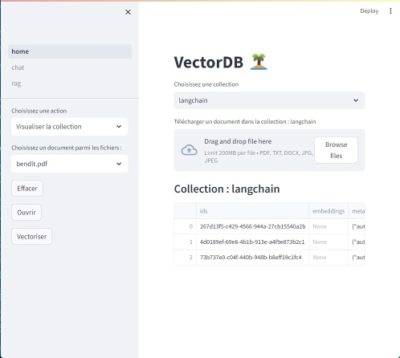
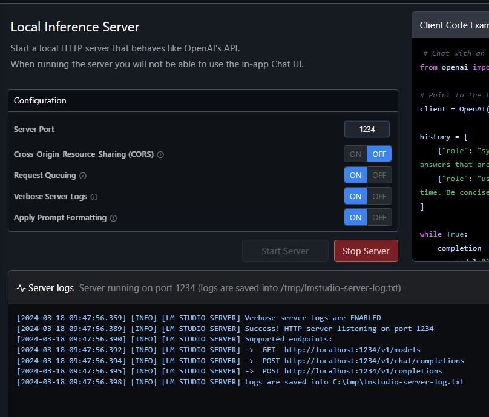
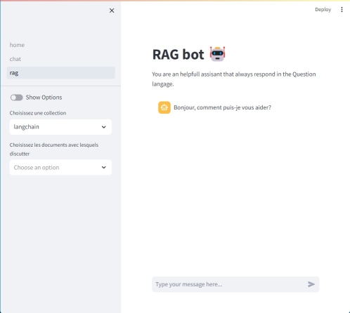
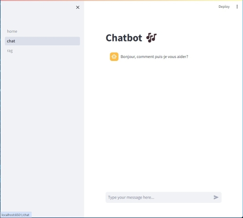

# Rag bot :smiley:
De l'intelligence artificielle sur ton ordi !  

🤗 [huggingface](https://huggingface.co/).

## langue 
La documentation du projet est en français, en UTF8.

## objectif 
Minimiser en local le matériel nécessaire pour l'emploi des technologies d'IA et en optimiser l'impact 🌤️.

En V1.0, l'application permet de questionner, discuter avec des propres documents sur un ordinateur non connecté.
En V1.1, l'application embarque le serveur de modèles Llama CPP.

# Installation
Pour fonctionner, l'application a besoin de différents composants.

## python
Langage de programmation de l'application :
- créer un projet python vierge 
- de préférence créer un environnement virtuel (avec venv par exemple)
- installer les librairies du fichier requirements.txt

Les librairies utilisées sont : 
- :sparkling_heart: streamlit : pour l'interface utilisateur de l'application (http://localhost:8501 par défaut) 
- :point_right: chromadb : pour stocker les documents vectorisés ( http://localhost:8000 par défaut)
- :stuck_out_tongue: langchain : pour simplifier la création de l'applications LLM

## Serveur LLM
L'application ouvre des port appeller les serveurs LLM en http://localhost.  
Deux options : 

### LM Studio (beginner)
- installer LM Studio sur votre ordinateur, télécharger un LLM (mistral 7b est parfait pour un pc portable), le servir en localhost (port 1234 par défaut)  
### llama_cpp[server] (default)
en version 1.1, l'application gère la mise en service de plusieurs modèles en simultanés.
- compiler Llama.cpp

### Embeddings
- par défaut l'application utilise le modèle d'embeddings hkunlp/instructor-xl disponible sur Huggingface :hugging_face:
- en version 1.1, n'importe quel modèle d'embedding peut être utilisé en cache.

## VectorStore
La base de données vectorielle implémentée est Chromadb.

# Mise en service

## exécuter lmstudio
Lancer LM Studio et servir le LLM 

## llama_cpp[server]
En verion 1.1 l'application intégre llama.cpp serveur, comme service de base.

L'interface portée avec streamlit permet de lancer autant de modèles que nécessaire en simultané.    

🤗 [huggingface](https://huggingface.co/).

## exécuter le serveur Chroma
- chroma run --path ./chroma
## exécuter l'application
- streamlit run home.py

# Badges

# Visuals
L'application dispose d'une interface graphique avec la base de données vectorielle chromadb.  

Elle permet : 
- la création, la supression de collections de documents 
- l'upload, la visualisation et la suppression de documents sur le serveur et dans les collections chromadb
- la vectorisation des documents dans la base de données chromadb
- la mise à jour des propriétés des documents stockés (métadatas)

Interroger les documents vectorisés dans les collections de la base chromadb.  
Les options permettent : 
- de modifier le contexte de la discussion
- choisir les documents avec lesquels discutter (un ou plusieurs)
- paramétrer le nombre de fragments pertinents à utiliser

Discuter avec le llm  

# More
## Hardware 
- minimum : ryzen 7 32 gb, no GPU  

## Support

## Roadmap
- améliorer l'API pour chromadb, gestion modification des metadatas.

- décoreller les fonctionnalités métier / prompt / rag de l'interface utilisateur

- encapsulation des prompts métier dans des agents

## Contributing
Toutes contributions sont les bienvenues.

N'hésitez pas à forker le projet v1.1 

## Authors and acknowledgment
Ressources, remerciements, inspirations en entête du code et des commentaires 

## License
Open source

## Project status
😄